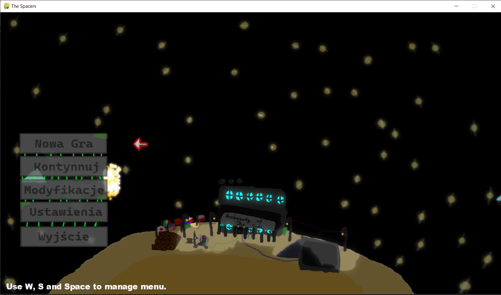
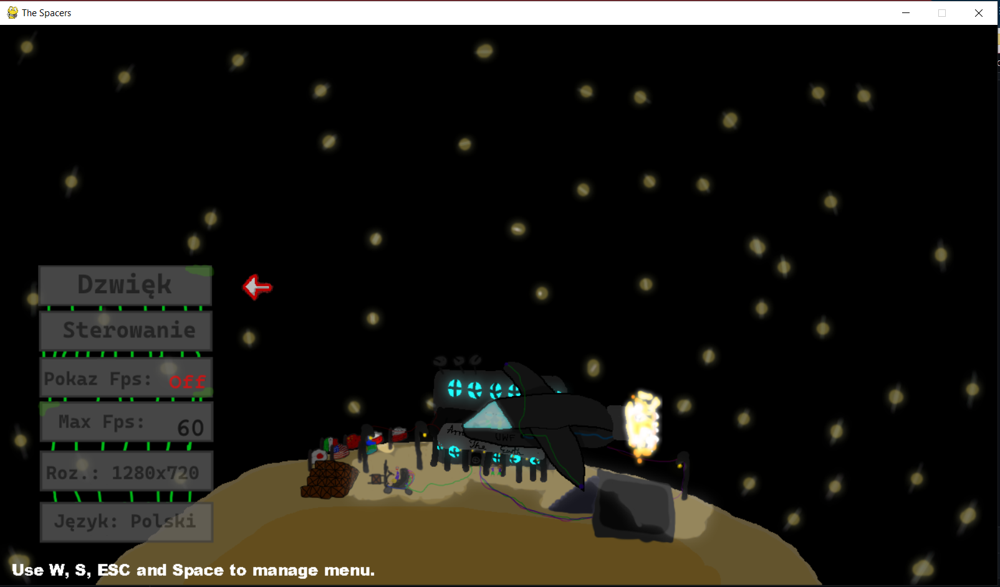
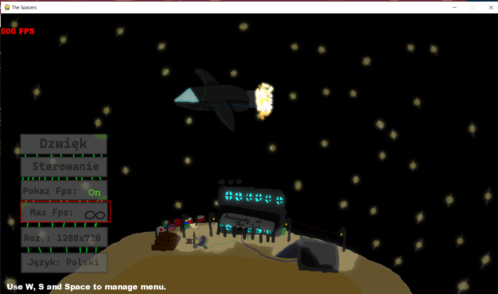
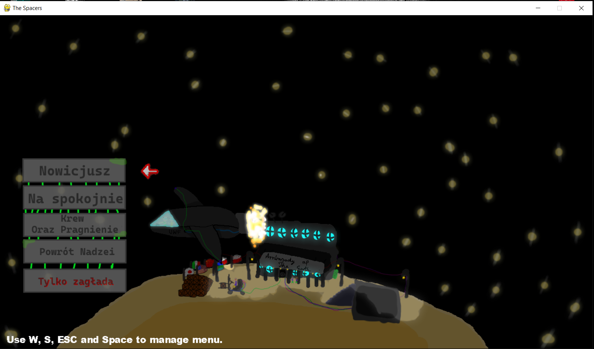
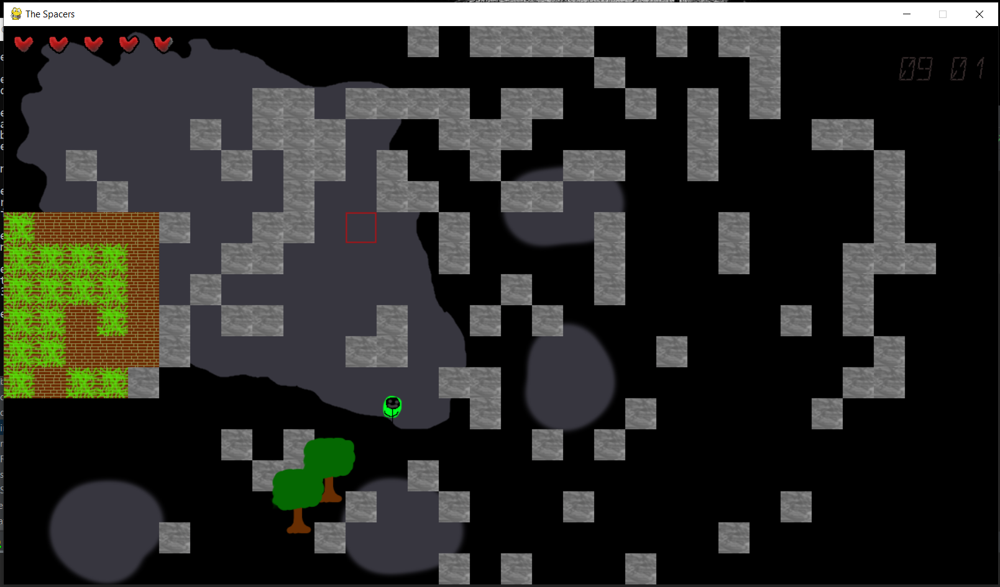
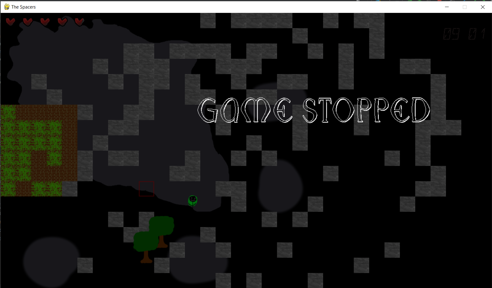

# Menu

## __Description__

That's was created just for fun, code is really messy and won't be continued. Don't expect too much from this. I'm adding this just because of nostalgia, but it can also be used to learn from someone who was doing
everything not "professional way" if you cannot understand "more professional code".

## __About media used__
I used several things that weren't created by me. Here's list:

Fonts:
	arbilk font is from WINDOWS 10 
	Monster font is created by Vladimir Nikolic 
	SEGMENT16C - Daniel Wikholm Font
music:
  music from menu is also not mine but i don't remember name.


## __Files hierarchy__
+  \assets <- graphics, music etc.
     - \fonts <- fonts
         * there are several fonts
     -  \img <- textures
          * \gui <- gui textures
             + yes, textures
          * yes, textures+      
	  * \maps <- maps
             + map.json <- map that is generated after first launch
     - \music
          * menumusic.ogg <- music from menu
     - \tiles
          * tiles
     - manifest.txt <- information about credentials
     - settings.json <- game settings (aka save file)
+  \mods <- doesnt working (except for opening it by menu)
+  main.py <- main file, if something is not somewhere else, it's there (you can find there also menu)
+  scene.py <- Main game scene (also loading map and saving it)
+  ingameclock.py <- rendering and working Clock object what has been used to maintaining "INGAME" time
+  colission.py <- very basic collision
+  camera.py <- ingme camera and rendering
+  blocks.py <- block system (doesn't include map generating)
  
### __Tiles system__
Tiles should be placed within **\assets\tiles\** .
Tiles starting with file named "TILENAME.json" here with this information:
```
{
	"colission": true,
	"objectType": "object",
	"mainTexture": "1.png",
	"editorIcon": "1.png",
	"isImportant": false,
	"transparent": true
}
```
where
	+ "colission": true, <- is player is able to walk through this tile
	+ "objectType": "object",  <- type of object (only object exist for now)
	+ "mainTexture": "1.png",   <- reference to texture of the tile
	+ "editorIcon": "1.png",    <- reference to texture of the tile (but in editor mode, gui)
	+ "isImportant": false,     <- Should be rendered before others tiles
	+ "transparent": true       <- is have transparent elements (if not programs use faster conversation (optimalization))


## __Content__

Game after launch starts with music and this view: 

You will be able to navigate through menu using W, S, ESCAPE, SPACE

+ After choosing settings you will see:

Where you can change your fps and if fps should be shown. 


+ After choosing new game you will se:

When theoretically you're going to be able to "choose" difficulty, but this is not working and you will be simply loaded into the map.
after choosing difficulty you will see the map:



You can stop game by ESC and you will see this

While your game is stopped, by clicking  F8 and L you can toogle DEV mode (bulding mode).


KEYS:
* h - hide menu
* n - noclip
* = - save map to map.json
* J - change tile (write name in console after clicking), requires menu being visible (0 = remove tool)
* l - change layer of editor, requires menu being visible (events layer is crashing after try of use it)

